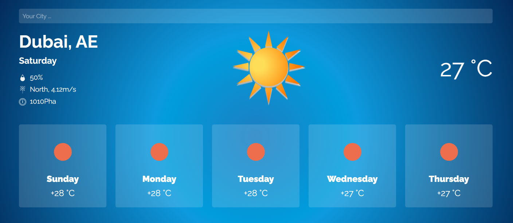

<h1 align="center">Show Weather with location and API</h1>

 

<strong>Features and capabilities</strong>

    <ul>
        <li>Show the weather by Location</li>
        <li>Show the weather by Search</li>
        <li>Show the weather for the coming days</li>
        <li>Display icons based on weather type</li>
        <li>Show Pressure, Humidity and Wind Speed</li>
    </ul>

<h2></h2>

<a href="https://mre-dev.github.io/weather/">----- Click To View Demo -----</a>

<h2></h2>

<strong>notice : </strong>
To run the project, you must run the project on a server or create a virtual server on your local system.

 

<strong>Weather API : </strong>
You can get a free API from 
<a href="https://openweathermap.org/">Openweathermap.org</a> 
to get weather information.

<strong>Geocoding API : </strong>
You can get a free API from 
<a href="https://locationiq.com/">locationiq.com</a> 
convert coordinates to the city name.

<h2></h2>

Screenshot

